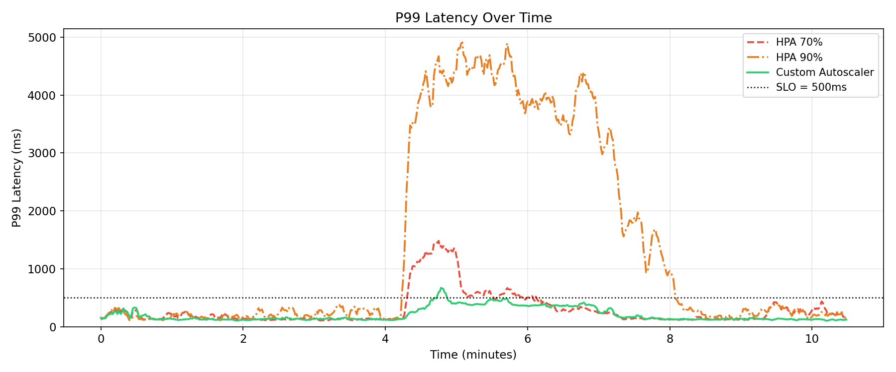
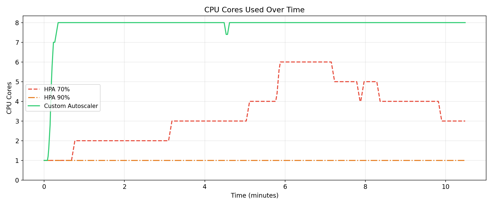
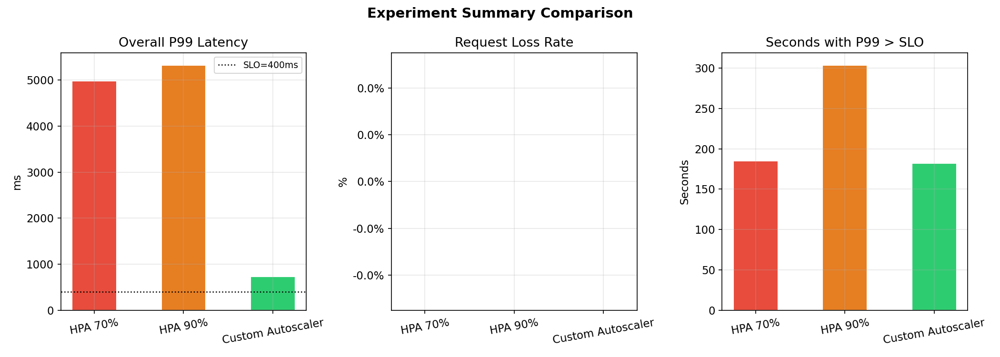

# Elastic ML Inference Serving System on Kubernetes

An autoscaling image-classification service on Kubernetes (Minikube) that serves ImageNet predictions from a ResNet18 model. The project compares a **custom, application-aware autoscaler** against Kubernetes' built-in **Horizontal Pod Autoscaler (HPA)** under a bursty workload.

## How it works

A load generator replays a fixed ~10-minute traffic trace against a **dispatcher**, which queues each request and forwards it to one of several **inference pods**. Each pod is pinned to a single CPU thread, so it's a predictable unit of capacity and throughput scales only by adding pods. **Prometheus** collects metrics, and a control plane decides how many pods to run — the only thing that changes between the three experiments.

## Components

| Component | Role | Port |
|---|---|---|
| `inference-service` | ResNet18 model server (the worker) | 8080 |
| `dispatcher` | Request queue, admission control, worker pool | 9000 |
| `autoscaler` | Custom control loop (queue + latency + CPU + rate trend) | — |
| `monitoring` | Prometheus — collects and stores metrics | 9090 |
| `load-tester` | Replays the traffic trace, records results | — |
| `experiments` | HPA baselines, run scripts, plotting | — |

The **custom autoscaler** reads four signals from Prometheus and scales *proactively* (before latency degrades), patching the Deployment and resizing the dispatcher's worker pool itself. The **HPA** baselines scale *reactively* on CPU alone and rely on the `dispatcher_sync` sidecar to keep the dispatcher in step.

## Setup & running

> Add a few sample images to `load-tester/sample_images/` before running — the load tester uses them as request payloads.

**1. Start Docker, then Minikube, and enable the metrics-server** (required by the HPA):

```bash
minikube addons enable metrics-server
```

**2. Switch to Minikube's Docker environment:**

```bash
eval $(minikube docker-env)
```

**3. Build the three images:**

```bash
docker build --no-cache -t inference-service:latest inference-service/
docker build --no-cache -t dispatcher:latest        dispatcher/
docker build --no-cache -t autoscaler:latest         autoscaler/
```

**4. Deploy the pods:**

```bash
kubectl apply -f inference-service/k8s/
kubectl apply -f dispatcher/k8s/
kubectl apply -f monitoring/prometheus-config.yaml
kubectl apply -f monitoring/prometheus.yaml
kubectl apply -f autoscaler/k8s/autoscaler.yaml
```

**5. Make the experiment scripts executable:**

```bash
chmod +x experiments/run_hpa_70.sh
chmod +x experiments/run_hpa_90.sh
chmod +x experiments/run_custom.sh
```

**6. Port-forward the three services** (each in its own terminal):

```bash
kubectl port-forward svc/inference-service 8080:8080
kubectl port-forward svc/dispatcher-service 9000:9000
kubectl port-forward svc/prometheus-service 9090:9090
```

**7. For the HPA runs only, start the dispatcher sync helper first** (from the `load-tester` directory). It mirrors the HPA-driven replica count into the dispatcher; the custom autoscaler does this itself, so it is **not** needed for `run_custom.sh`:

```bash
python3 dispatcher_sync.py
```

**8. Run one experiment at a time** (from the `experiments` directory):

```bash
./run_custom.sh
./run_hpa_70.sh
./run_hpa_90.sh
```

**9. Watch the replicas scale live:**

```bash
kubectl get deployment inference-deployment -w   # custom autoscaler
kubectl get hpa inference-hpa-70 -w              # HPA 70%
kubectl get hpa inference-hpa-90 -w              # HPA 90%
```

**10. Generate the comparison plots** (from the `experiments` directory):

```bash
python plot_results.py
```

## Results

All three configurations served the same **9,917 requests with zero drops or timeouts** — they differ only in tail latency and the capacity used to achieve it.

### P99 latency over time



During the spike (minutes ~4–8) the custom autoscaler stays near the 500 ms SLO, HPA 70% overshoots to ~1.5 s, and HPA 90% climbs to ~5 s because it effectively never scales.

### Provisioned inference pods over time



The custom autoscaler ramps to 6–8 pods ahead of and through the spike; HPA 70% lags up to 5; HPA 90% stays at 1. *(Each pod is one core, so this is provisioned capacity, not measured CPU.)*

### Summary comparison



Average p99 latency (left) and the number of time windows breaching the 500 ms SLO (right). The custom autoscaler is lowest on both.

| Configuration | Mean p99 | Peak p99 | Windows over SLO | Avg. pods |
|---|---|---|---|---|
| **Custom** | ~209 ms | ~716 ms | 17 | ~6.7 |
| HPA 70% | ~299 ms | ~1,829 ms | 93 | ~2.7 |
| HPA 90% | ~1,400 ms | ~5,700 ms | 239 | 1.0 |

**Takeaway:** the custom autoscaler held the tightest tail latency by scaling ahead of the spike on queue and rate signals — at the cost of provisioning more pods. The CPU-only HPA either lagged the spike (70%) or never reacted (90%).

---